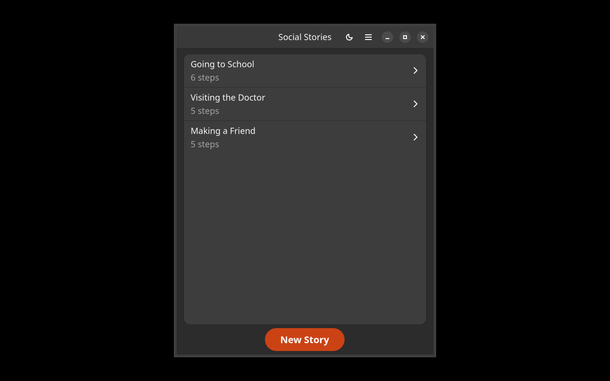
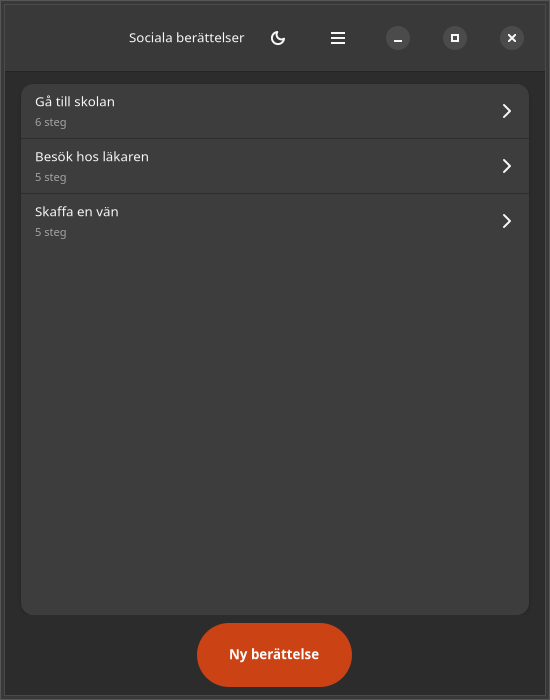

# Sociala Berättelser

Create and view social stories with images for autism support.

Built with GTK4/Adwaita. Part of the [Danne L10n Suite](https://github.com/yeager/debian-repo).

## Installation

### Debian/Ubuntu
```bash
sudo apt install socialaberattelser
```

### Fedora/RPM
```bash
sudo dnf install socialaberattelser
```

## License

GPL-3.0

## Author

Daniel Nylander — [danielnylander.se](https://danielnylander.se)

## Screenshots





